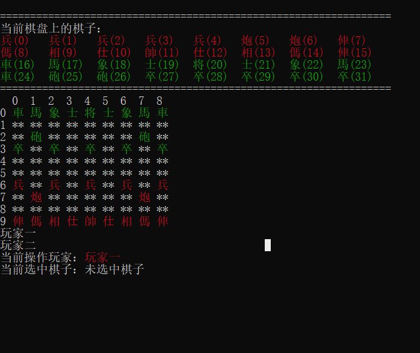
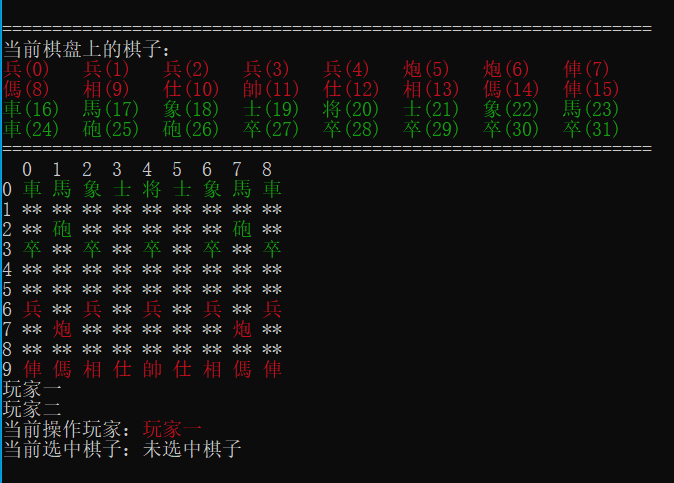

# 象棋

## 简介

这是一款基于C语言实现的单机版中国象棋游戏

## 软件设计

### 结构

- 第一层：基本数据结构
  - 棋子
  - 行动
- 第二层：辅助型数据结构
  - 棋子栈
  - 行动栈
  - 等
- 第三层：组合数据结构、数据核心
  - 棋盘
- 第四层：逻辑核心、人机交互
  - 逻辑判断模块
  - 操作模块
  - 消息管理模块

### 寻路算法

玩家选中棋子后，系统调用寻路函数将棋子的所有可行动位置一一枚举，用一个的二维数组进行记录。
可以作为玩家或ai的目的地参考，目标位置在存储于moveablePos中的二维数组为true，是棋子可以移动必要条件

## 操作方法

1. 选择阶段
   1. 输入坐标一，表示选中的棋子，进入操作阶段。
   2. 输入字母'w'，表示撤销。
   3. 输入字母'q'，表示结束游戏。
2. 操作阶段
   1. 输入坐标二，表示将选中的棋子移到指定位置；
   2. 输入 "cancel"，表示取消行动。

## 胜负判断

将军死亡后，将死一方判负，另一方胜利。

## 更新日志

1. v1.0.0：
   1. 初步实现了基本的移动逻辑
2. v1.1.0：2023.03.02
   1. 初步实现了撤销功能
   2. 每一次移动都会产生一条指令记录（init_pos, dest_pos, remove_block)存储在棋盘内的二维数组中
   3. 在选择阶段输入w即可执行一次撤销，一次撤销回退记录中最迟的两条指令
   4. 实现了一次大重构
3. v1.1.1: 2023.03.02
   1. 优化了清屏闪烁，但造成了一定程度的滞留
   2. 修复了双方最近被击败的棋子不显示问题

## 测试案例

### 棋谱一

77 07

06 24

07 04

### 棋谱二

96 74

06 24

62 42

cancel

62 52

36 46

91 72

01 20

90 80

00 10

80 85

07 26

85 55

10 13

97 76

13 43

95 84

05 14

66 56

08 06

98 95

30 40

95 75

26 47

77 27

21 27

55 45

43 45

75 45

47 66

45 55

46 56

55 56

06 56

74 56

20 41

71 51

34 44

72 53

41 53

51 53

27 26

53 63

38 48

63 62

26 36

92 74

04 05

84 73

02 20

93 84

32 42

52 42

20 42

62 61

42 20

61 51

36 35

51 55

66 78

55 05

### 棋谱三

96 74

06 24

62 42

cancel

62 52

36 46

91 72

01 20

w

w

w

## 棋谱四

77 07

08 07

71 77

27 97

98 97

07 77

97 77

21 24

77 07

w

w

w

w

## 鸣谢

1. [ScreenToGif](https://github.com/NickeManarin/ScreenToGif)，第一次学会了录制Gif
